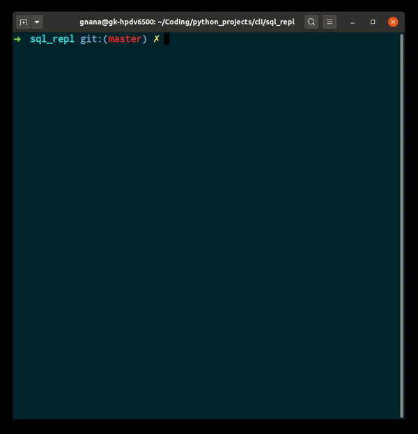

# SQshell

<!--  -->

This is an SQL REPL written in Python. It has syntax highlighting, fish-style history autocompletion, tab-completion for keywords, and Vim/Emacs editing modes. 

## Install
On Linux:
```sh
$ git clone https://github.com/sandkoan/SQshell.git
$ cd SQshell
$ pip3 install -r requirements.txt
```
or Windows:
```cmd
> git clone https://github.com/sandkoan/SQshell.git
> cd SQshell
> pip install -r requirements.txt
```

## Usage
On Linux:
```sh
$ python3 sqshell.py
```
or Windows:
```cmd
> python sqshell.py
```

History autocompletion is loaded from a `.sqshell_history` file in the same directory that contains `sqshell.py`.
Don't delete it, unless you really want to.
